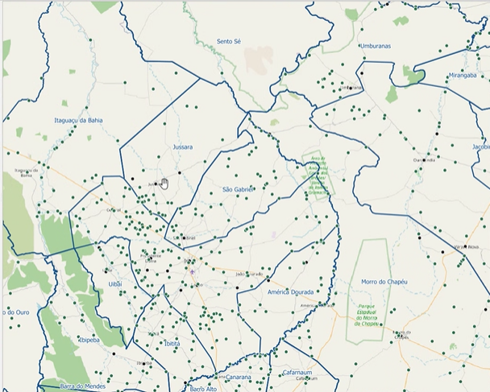
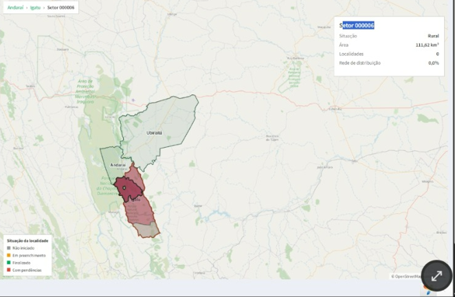

# SR-ADR-0002: Módulo de Saneamento Rural — decisões iniciais de abrangência dos formulários

**Status:** Decisão consentida em conjunto pela equipe

**Data:** 25/09/2026

**Contexto do projeto:** TED nº 996611 — SNSA/Ministério das Cidades × UNIVASF (36 meses, mês 1 = maio/2026)

**Meta relacionada:** Meta 4 — Produtos 4.1 e 4.2

**Decisores:** Coordenação Geral do TED (UNIVASF) · Equipe técnica da SNSA

## Decisão tomada
A reunião abarcou a questão de que <strong>unidade</strong> escolher para a disponibilização do preenchimento de formulários na coleta do módulo de saneamento rural. Optou-se pela escolha de <strong>distrito</strong>, com a aglutinação das informações de setores em modal, e a utilização do Open Street Map para ferramenta de referência no espaço geográfico.

## Resumo da reunião
Discutiu-se que a disponibilização do preenchimento de formulários por localidade geraria um grande overhead dado à quantidade de dados tanto para o funcionamento do software quanto para a pré-carga de dados e pós-processamento, dada a grande quantidade de localidades por município. Mesmo a escolha de setores, geraria um grande número, derrubando o número de cerca de 77 mil (localidades) para 68 mil. A opção de distritos derruba esse número para cerca de 10 mil.

## Imagens do mapeamentos de localidades dentro do software

O [fluxograma original discutido na reunião](../assets/diagramas/saneamento-rural/fluxograma-original.png) está aqui dividido em três partes. Os marcos “Iniciar preenchimento” e “Revisar preenchimento da participação” conectam uma parte à seguinte. Clique nas imagens para abrir os fluxogramas e ampliar a visualização.

| 1. Localidades | 2. Municípios e Distritos e Setores |
| --- | --- |
| Indicação das **localidades** no mapa. | Visualização de **municípios, distritos e setores**. |
|  |  |

