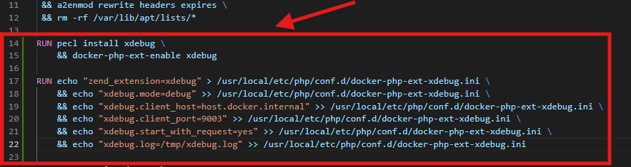
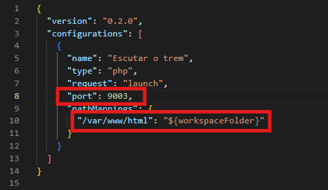
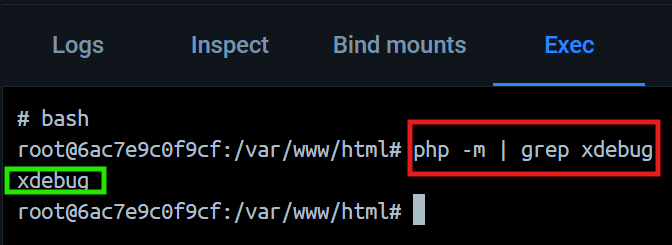
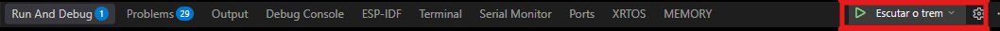
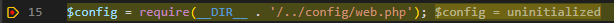

# Configurando o Xdebug na aplicação

Este guia descreve a configuração do Xdebug no contêiner PHP e do depurador no Visual Studio Code, permitindo acompanhar a execução da aplicação com pontos de parada (*breakpoints*).

Documento original: [Configurando o Xdebug na aplicação — PDF original](../assets/aspectos-desenvolvimento/configurando-xdebug.pdf).

## Ambiente do exemplo

| Item | Valor |
| --- | --- |
| Aplicação | PHP executado em contêiner Docker. |
| Editor | Visual Studio Code, com suporte à depuração PHP. |
| Porta do depurador | `9003`. |
| Diretório da aplicação no contêiner | `/var/www/html`. |
| Endereço de acesso à aplicação | `http://localhost:8080`. |

Abra a raiz da aplicação como pasta de trabalho no VS Code. Os caminhos e as portas abaixo correspondem ao ambiente mostrado no documento.

## 1. Configurar o Dockerfile

Abra o arquivo `Dockerfile` na raiz da aplicação. Abaixo do bloco que instala as extensões PHP, adicione a instalação e a configuração do Xdebug:

```dockerfile
RUN pecl install xdebug \
    && docker-php-ext-enable xdebug

RUN echo "zend_extension=xdebug" > /usr/local/etc/php/conf.d/docker-php-ext-xdebug.ini \
    && echo "xdebug.mode=debug" >> /usr/local/etc/php/conf.d/docker-php-ext-xdebug.ini \
    && echo "xdebug.client_host=host.docker.internal" >> /usr/local/etc/php/conf.d/docker-php-ext-xdebug.ini \
    && echo "xdebug.client_port=9003" >> /usr/local/etc/php/conf.d/docker-php-ext-xdebug.ini \
    && echo "xdebug.start_with_request=yes" >> /usr/local/etc/php/conf.d/docker-php-ext-xdebug.ini \
    && echo "xdebug.log=/tmp/xdebug.log" >> /usr/local/etc/php/conf.d/docker-php-ext-xdebug.ini
```



Se o Dockerfile já tiver esse bloco, confira os valores existentes para evitar duplicá-lo. Na cópia local consultada, a configuração já existe e utiliza a variável `DEBUGPATH` para o caminho do arquivo INI.

Após alterar o Dockerfile, reconstrua a imagem e recrie o serviço da aplicação. No Compose do projeto, o serviço se chama `app`:

```bash
docker compose up -d --build app
```

É preciso construir a imagem novamente.

## 2. Configurar o depurador no VS Code

Crie ou ajuste o arquivo `.vscode/launch.json` na raiz da aplicação:

```json
{
  "version": "0.2.0",
  "configurations": [
    {
      "name": "Escutar o trem",
      "type": "php",
      "request": "launch",
      "port": 9003,
      "pathMappings": {
        "/var/www/html": "${workspaceFolder}"
      }
    }
  ]
}
```

O rótulo “Escutar o trem” é o nome da tarefa criada para o VS Code; ele identifica a configuração na lista de depuração do VS Code.



O valor de `port` deve corresponder a `xdebug.client_port`. O `pathMappings` relaciona o diretório da aplicação dentro do contêiner com a pasta aberta no editor. No Dockerfile, a pasta raiz é definida por:

```dockerfile
WORKDIR /var/www/html
```

## 3. Verificar se a extensão está carregada

No terminal **dentro do contêiner PHP**, execute:

```bash
php -m | grep xdebug
```

O resultado esperado é:

```text
xdebug
```



Essa verificação confirma que o PHP carregou a extensão. A conexão com o editor será verificada no próximo passo.

## 4. Testar com um breakpoint

1. Abra a área **Executar e Depurar** do VS Code.
2. Selecione a configuração **Escutar o trem** e inicie o depurador.
3. Abra `web/index.php` e marque um breakpoint em uma linha executável. O documento usa a linha que carrega `config/web.php`.
4. Acesse ou atualize `http://localhost:8080` no navegador.
5. Confira se o VS Code pausa a execução no breakpoint.





## Resultado esperado

Ao abrir a aplicação no navegador, o depurador interrompe a execução no ponto marcado, permitindo inspecionar variáveis e acompanhar o fluxo do código.
