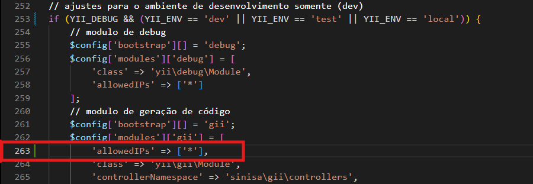
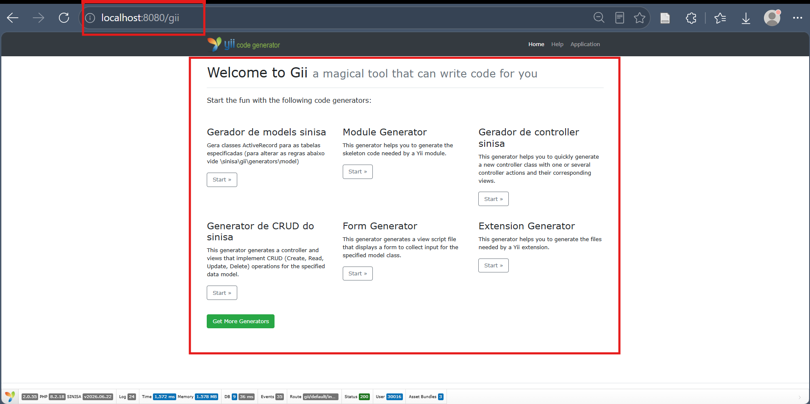

# Construção de módulos através do Gii

Este guia apresenta a habilitação e o acesso ao Gii, o gerador de código utilizado pela aplicação. O documento de origem cobre a preparação do ambiente e a abertura da página de geradores.

Link das instruções em pdf: [Construção de módulos através do Gii — PDF original](../assets/aspectos-desenvolvimento/construcao-modulos-gii.pdf).

## 1. Configurar o acesso ao Gii

Abra `config/web.php` na raiz da aplicação e localize o bloco de configuração dos módulos de desenvolvimento.

O exemplo habilita os módulos quando `YII_DEBUG` está ativo e o ambiente é `dev`, `test` ou `local`:

```php
if (YII_DEBUG && (YII_ENV == 'dev' || YII_ENV == 'test' || YII_ENV == 'local')) {
    // Configurações dos módulos de desenvolvimento.
}
```

Dentro desse bloco, localize a configuração existente em `$config['modules']['gii']` e ajuste a opção `allowedIPs` para:

```php
'allowedIPs' => ['*'],
```

Localize o seguinte trecho e inclua:

```php
$config['bootstrap'][] = 'gii';
$config['modules']['gii'] = [
    'allowedIPs' => ['*'],
    'class' => 'yii\gii\Module',
    'controllerNamespace' => 'sinisa\gii\controllers',
    // As configurações existentes de generators continuam neste array.
];
```

Esse trecho indica onde fica a opção; ao editar o arquivo, altere a configuração existente sem substituir o array completo por este recorte.



O valor `['*']` libera qualquer endereço IP nessa verificação. No exemplo do documento, essa opção permanece dentro da condição de depuração e dos ambientes de desenvolvimento citados acima. A alteração trata o bloqueio por IP que pode causar a resposta **403 — Proibido** ao acessar o Gii.

## 2. Iniciar os serviços da aplicação

No terminal, a partir da pasta que contém o arquivo Compose, execute o comando apresentado no documento:

```bash
docker-compose up -d
```

Se o ambiente utiliza o comando integrado do Docker Compose, a forma correspondente é:

```bash
docker compose up -d
```

## 3. Abrir a página de geradores

Acesse a rota `/gii` na porta publicada pela aplicação:

```text
http://localhost:<porta-escolhida>/gii
```

A porta escolhida no exemplo é `8080`:

```text
http://localhost:8080/gii
```


