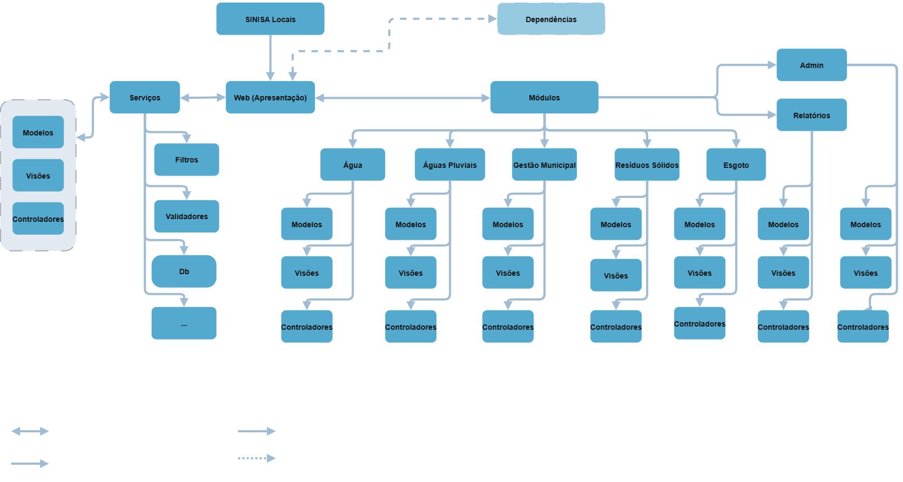

# Visão geral da arquitetura

**Situação:** Em elaboração.

## Objetivo e escopo

Apresentar a organização de arquitetura do SINISA Locais, suas camadas, módulos e dependências. O diagrama mostra o ponto de entrada (web — entrada de requisição/entrada no sistema), os serviços e a organização em modelos, visões e controladores.

**Versão ou commit de referência:** sistema apresentado para a coleta de 2026, tal como recebido.

**Responsável:** Roberto Vítor.

## Diagrama de arquitetura

[Abrir diagrama em tamanho original](../assets/diagramas/sinisa-locais/arquitetura.png).

## Componentes e responsabilidades

Os elementos abaixo seguem os rótulos do diagrama.

| Componente | Descrição inicial | Localização no código |
| --- | --- | --- |
| Apresentação | Camada de apresentação indicada no diagrama; lida com as requisições e com as configurações de instanciação da aplicação | Pasta  `web` na raiz do projeto |
| Serviços | Agrupa filtros, validadores, classes-pai com os métodos de acesso à base de dados, ao core da aplicação e outros elementos; | Pastas `sinisa` e `services` na raiz do projeto |
| Dependências | As dependências da aplicação | Pasta `vendor` na raiz do projeto |
| Modelos, visões e controladores | Organização presente na estrutura geral e nos módulos; agrupa as funções basais da aplicação — isto é, define as classes-pai com os métodos que serão herdados pelos módulos | Pastas *`M(odels)-V(iews)-C(ontrollers)`* na raiz do projeto|

## Organização dos módulos

| Módulo representado | Responsabilidade e limites |
| --- | --- |
| Água | Agrupa as funções da coleta de água |
| Águas Pluviais | Agrupa as funções da coleta de águas pluviais/drenagem |
| Gestão Municipal | Agrupa as funções da coleta de gestão municipal. Ver [documentação do módulo](gestao-municipal.md). |
| Resíduos Sólidos | Agrupa as funções de coleta de resíduos sólidos. |
| Esgoto | Agrupa as funções de coleta de esgoto. |
| Admin | Permite ao usuário interno cadastrar usuário, prestador, iniciar a coleta. |
| Relatórios | Permite acesso e personalização aos relatórios. |

## Documentação relacionada

- [Casos de uso dos módulos de coleta](casos-de-uso.md).
- [Fluxo de login](fluxo-login.md).
- [ADR-0001 — Plataforma de backend](../adr/ADR-0001-plataforma-backend-sinisa.md): proposta de decisão e estratégia de evolução, com status próprio.

As escolhas técnicas e suas justificativas devem ser registradas em ADRs. Esta página descreve a estrutura do sistema na versão de referência.
