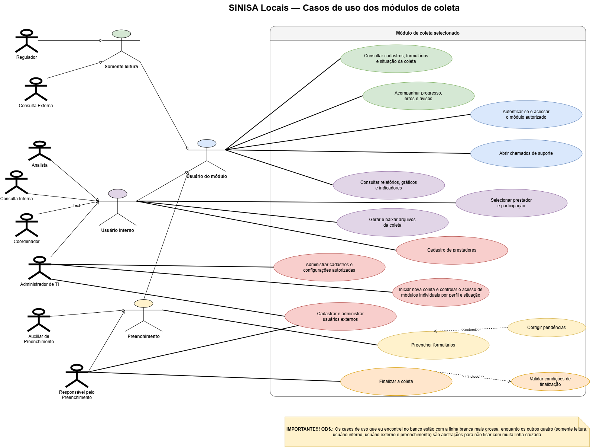

# Casos de uso dos módulos padrões de coleta

**Situação:** Em elaboração;

## Objetivo e escopo

**Objetivo:**Apresentar os atores e as funcionalidades representadas para um módulo de coleta selecionado no SINISA Locais.
<i>Obs.: No diagrama, os atores reais (listados no banco de dados) estão com o traçado branco mais forte. O restante são abstrações para simplificar o diagrama</i>

**Módulos:** Módulos padrão do sistema apresentados na coleta de 2026 - água, águas pluviais, esgoto, gestão municipal, resíduos sólidos e administrador.

**Responsável:** Roberto Vítor.

## Diagrama de casos de uso

[Abrir diagrama em tamanho original](../assets/diagramas/sinisa-locais/casos-de-uso.png).

## Casos de Uso, Atores e Agrupamentos

Os identificadores abaixo referem-se a cada um dos casos de uso verificados no sistema; os casos de uso em itálico são *extensões* ou *inclusões* de outros (a referência está adicionada ao texto como "Ref").

| Identificador  (Use Case)| Caso de uso |
| --- | --- |
| UC-01 | Autenticar-se e acessar o módulo autorizado. |
| UC-02 | Consultar cadastros, formulários e situação da coleta. |
| UC-03 | Acompanhar progresso, erros e avisos. |
| UC-04 | Consultar relatórios, gráficos e indicadores. |
| UC-05 | Selecionar prestador e participação. |
| UC-06 | Gerar e baixar arquivos da coleta. |
| UC-07 | Administrar cadastros e configurações autorizadas. |
| UC-08 | Cadastrar e administrar usuários externos. |
| UC-09 | Preencher formulários. |
| *UC-10* | *Corrigir pendências. Ref: UC-09* |
| UC-11 | Finalizar a coleta. |
| *UC-12* | *Validar condições de finalização. Ref: UC-11* |

| Atores | Descrição |
| --- | --- |
| Administrador de TI. | Agrupa todos os casos de uso do sistema |
| Coordenador | Realiza de UC-01 A UC-06, com os casos de uso de preenchimento também (UC-09 a UC-12; na modalidade preenchimento interno). |
| Analista | '' |
| Consulta Interna | '' |
| Regulador| Realiza de UC-01 a UC-05, responsável pelo acompanhamento da situação de coleta|
| Consulta Externa | Realiza de UC-01 a UC-05, responsável pelo acompanhamento da situação de coleta|

| Agrupamentos | Descrição |
| --- | --- |
| Usuário do módulo | Agrupa usuário interno, preenchimento e somente leitura. |
| Somente leitura | Agrupa Regulador e Consulta Externa no diagrama. |
| Usuário interno | Agrupa Analista, Consulta Interna, Coordenador e Administrador de TI no diagrama. |
| Preenchimento | Agrupa Auxiliar de Preenchimento e Responsável pelo Preenchimento no diagrama. |

## Detalhamento dos casos de uso

*Em elaboração*

## Documentação relacionada

- [Visão geral da arquitetura](arquitetura.md).
- [Fluxo técnico de login](fluxo-login.md), relacionado ao UC-01.
