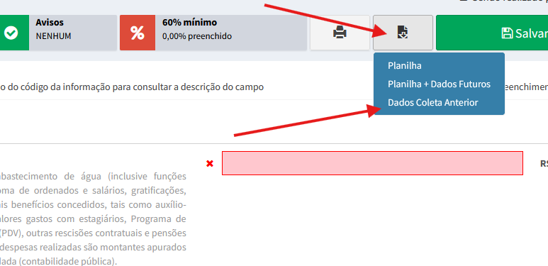
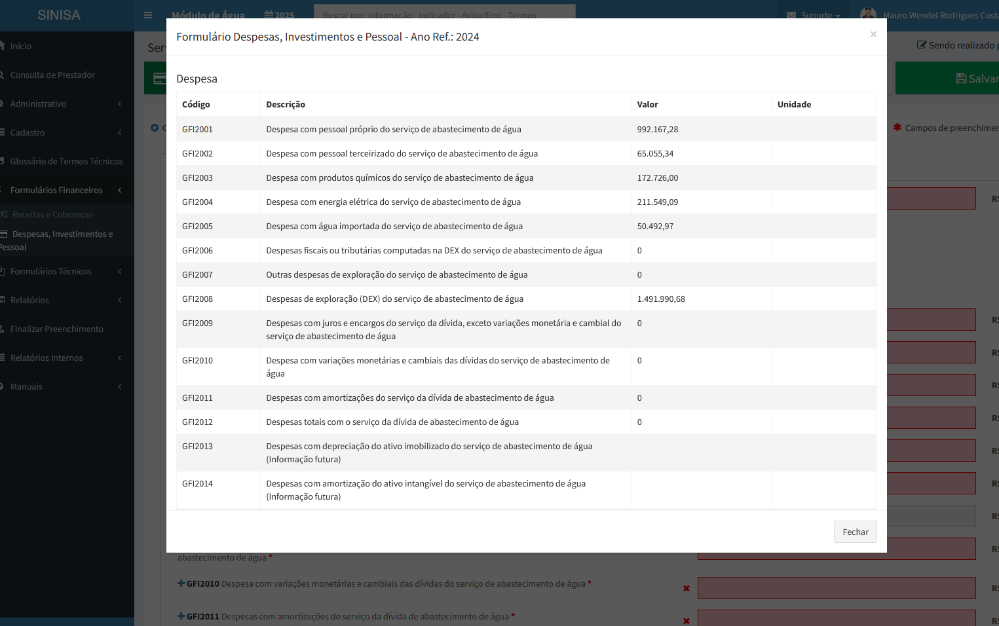

# Dados da Coleta Anterior

## Objetivo

Permitir que usuários internos consultem, sem sair do formulário atual, os dados registrados pelo prestador na coleta imediatamente anterior.

## Público e pré-requisitos

- A funcionalidade é exclusiva de usuários internos.
- É necessário selecionar um prestador e acessar um formulário de coleta.
- Para exibir conteúdo, deve existir um registro para a referência anterior, a mesma participação e o mesmo município.

## Como usar

1. Abra o formulário de coleta desejado.
2. No botão **Baixar / Exibir**, selecione **Dados Coleta Anterior**.
3. Aguarde o carregamento da janela.
4. Consulte os dados agrupados por bloco.

Se não houver registro anterior, o sistema informa: **“Prestador não possui dados na coleta anterior.”**

## Telas da funcionalidade

Seleção da opção no menu **Baixar / Exibir**:

Exibição dos dados recuperados no modal:

## Regras de negócio

- Usuários externos não visualizam o item no cabeçalho.
- O endpoint também bloqueia requisições diretas de usuários externos.
- Campos de múltipla escolha e atributos/valores são apresentados com a descrição dos itens selecionados.
- A referência é calculada dinamicamente a partir da participação/formulário selecionado: a consulta usa a referência atual menos um. O parâmetro global de referência é apenas um fallback.

## Visualização responsiva

As tabelas usam larguras proporcionais para Código, Descrição, Valor e Unidade. Textos extensos quebram dentro da célula sem invadir colunas vizinhas. Em telas pequenas, a tabela preserva uma largura de leitura e permite rolagem horizontal.

## Validação técnica

- Verificação de sintaxe PHP (php -l) concluída para o controlador e o cabeçalho.
- A validação funcional requer ambiente com banco de dados, incluindo um prestador com coleta anterior e outro sem dados na referência anterior.

## Documentação técnica

| Arquivo | Alteração realizada |
| --- | --- |
| sinisa/web/GestaoMunicipalController.php | Incluídos o cálculo dinâmico da referência atual, a recuperação do registro anterior por participação e município, a preparação dos campos JSON/atributos e o endpoint AJAX exibir-coleta-anterior. |
| views/cabecalho-forms-coleta-subnivel.php | Incluídos o item no dropdown de **Baixar / Exibir**, o modal, a chamada AJAX, os estados de carregamento/sem dados e os ajustes responsivos das tabelas. |

O HTML retornado pelo endpoint recebe um contêiner próprio para que os estilos de responsividade sejam limitados ao modal e não alterem a impressão/PDF existente. As larguras das colunas são aplicadas em cada tabela após o carregamento para evitar que estilos legados comprimam a coluna Código.
