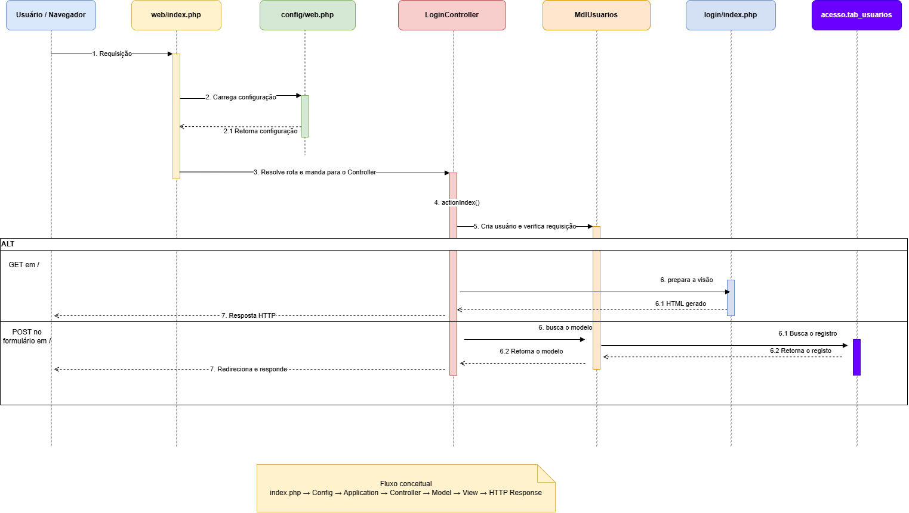

# Fluxo de login

**Situação:** Em elaboração;

## Objetivo e escopo

Documentar a sequência de interações a nível de requisições no SINISA Locais, o modelo escolhido para representação foi o fluxo de login.

**Caso de uso relacionado:** UC-01 — Autenticar-se e acessar o módulo autorizado, no [catálogo de casos de uso](casos-de-uso.md).

**Versão ou commit de referência:** Versão da colera de 2026.

**Responsável:** Roberto Vítor.

## Diagrama de sequência

[Abrir diagrama em tamanho original](../assets/diagramas/sinisa-locais/login-sequencia.png).

## Participantes

Os nomes abaixo são os exibidos no diagrama.

| Participante | Papel representado | Caminho ou referência no código |
| --- | --- | --- |
| Usuário / Navegador | Inicia a requisição e recebe a resposta. | --|
| `web/index.php` | Ponto de entrada da requisição. | -- |
| `config/web.php` | Configuração carregada durante a inicialização da aplicação. | -- |
| `LoginController` | Controlador associado a `actionIndex()`, para o Login, Logout e afins. | -- |
| `MdlUsuarios` | Modelo de usuários envolvido no fluxo. | -- |
| `login/index.php` | Visão apresentada no fluxo, associada ao controlador de login. | -- |
| `acesso.tab_usuarios` | Tabela consultada no fluxo. | -- |

## Pré-condições

*Em elaboração*

## Sequência representada

1. O navegador inicia a requisição.
2. O ponto de entrada carrega a configuração.
3. A rota é resolvida e encaminhada ao controlador.
4. O diagrama indica a chamada de `actionIndex()` e a interação com `MdlUsuarios`.
5. O fragmento `ALT` apresenta caminhos envolvendo a preparação da visão ou a consulta ao registro de usuário.
6. O fluxo termina com uma resposta HTTP ou um redirecionamento, conforme o caminho percorrido.

## Alternativas e tratamento de erros

*Em elaboração*

## Sessão e autorização

*Em elaboração*

## Pós-condições

**Em caso de sucesso:** Segue para o fluxo de SiteController, onde estão os módulos.

**Em caso de falha:** Volta para a tela de login, apontando os erros.

## Observações

- A caixa `ALT` representa duas condições vinculadas 
às requisições de acesso à página (GET) e envio do formulário (POST).

## Documentação relacionada

- [Visão geral da arquitetura](arquitetura.md).
- [Casos de uso dos módulos de coleta](casos-de-uso.md).
